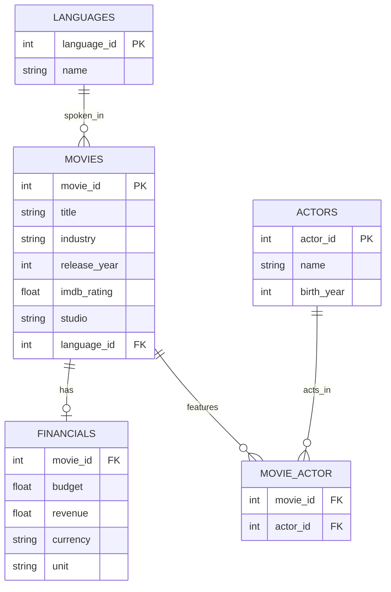
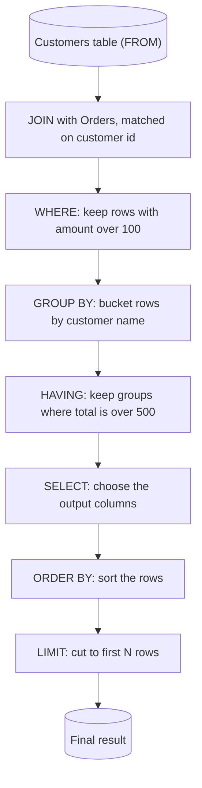

# SQL Basics — Complete Notes

*Data Retrieval: Single Table → Multiple Tables*

## About These Notes

These notes cover the full "Basic SQL" module: text and numeric filtering, summary analytics, `HAVING`, calculated columns, and every flavor of `JOIN`. Every example below runs against the actual practice database you used in the course, so the numbers you see here are real — not generic placeholders.

Each topic follows the same pattern: **concept → syntax → worked example → key takeaways**, with your own exercise answers folded in as practice checkpoints where you have them. A full **Deep Dive** on how SQL actually executes a query (built from your own research) sits near the end, and a one-page **Cheat Sheet** wraps things up.

SQL keywords are written in `UPPERCASE` and code is formatted consistently throughout, even in spots where the original course scratchpad was more casual — same logic, cleaner presentation.

> **Dialect note:** functions like `GROUP_CONCAT()`, `IF()`, and `CURDATE()` are **MySQL-specific**. If you ever move to PostgreSQL or SQL Server, the equivalents are `STRING_AGG()`/`ARRAY_AGG()` for `GROUP_CONCAT`, a `CASE` expression for `IF`, and `CURRENT_DATE`/`GETDATE()` for `CURDATE`.

---

## Table of Contents

1. [The Database Schema](#the-database-schema)
2. [The Big Picture: Query Execution Order](#the-big-picture-query-execution-order)
3. [Single-Table Queries](#single-table-queries)
   - [Selecting & Filtering Text](#selecting-filtering-text-select-where-distinct-like)
   - [Numeric Filtering & Sorting](#numeric-filtering-sorting-between-in-order-by-limit-offset)
   - [Summary Analytics](#summary-analytics-count-min-max-avg-group-by)
   - [The HAVING Clause](#the-having-clause)
   - [Calculated Columns](#calculated-columns-if-case-year-curdate)
4. [Multi-Table Queries](#multi-table-queries)
   - [Why Split Data Across Tables?](#why-split-data-across-multiple-tables)
   - [JOIN Types: INNER, LEFT, RIGHT, FULL](#join-types-inner-left-right-full)
   - [CROSS JOIN](#cross-join)
   - [Joining 3+ Tables & GROUP_CONCAT](#joining-3-tables-group_concat)
5. [Deep Dive: How SQL Actually Executes a Query](#deep-dive-how-sql-actually-executes-a-query)
6. [Cheat Sheet](#cheat-sheet)

---

## The Database Schema

Everything in the single-table and multi-table sections runs against this **movies database** — 39 movies, 40 financial records, 67 actors, and 8 languages.

| Table | Key Columns | Purpose |
|---|---|---|
| `movies` | `movie_id` (PK), `title`, `industry`, `release_year`, `imdb_rating`, `studio`, `language_id` (FK) | One row per movie |
| `languages` | `language_id` (PK), `name` | Lookup table — Hindi, Telugu, Kannada, Tamil, English, French, Bengali, Gujarati |
| `financials` | `movie_id` (FK), `budget`, `revenue`, `currency`, `unit` | Money data, kept separate from `movies` |
| `actors` | `actor_id` (PK), `name`, `birth_year` | One row per actor |
| `movie_actor` | `movie_id` (FK), `actor_id` (FK) | **Bridge table** — links movies ↔ actors (many-to-many) |



`movie_actor` is a **junction / bridge table**: it has no data of its own, just two foreign keys. That's the standard way to model a many-to-many relationship (one movie has many actors, one actor is in many movies) — you can't do it with a single foreign key on either side.

A second, unrelated pair of tables shows up only for the `CROSS JOIN` demo:

| Table | Columns | Sample rows |
|---|---|---|
| `items` | `name`, `price` | vada pav (10), dosa (20), sandwich (16) |
| `variants` | `variant_name`, `variant_price` | butter (5), cheese (10), plain (0) |

These two share **no key at all** — that's the point (see [CROSS JOIN](#cross-join) below).

---

## The Big Picture: Query Execution Order

Before the syntax, one mental model makes everything else click: the order you **type** a query is not the order SQL **runs** it.

| You write it as... | SQL actually processes it as... |
|---|---|
| `SELECT` | `FROM` |
| `FROM` | `JOIN` / `ON` |
| `JOIN ... ON` | `WHERE` |
| `WHERE` | `GROUP BY` |
| `GROUP BY` | `HAVING` |
| `HAVING` | `SELECT` |
| `ORDER BY` | `ORDER BY` |
| `LIMIT` | `LIMIT` |

This single fact explains several rules you'll hit naturally while writing queries:

- Why you filter individual rows with `WHERE` but filter *groups* with `HAVING` (groups don't exist yet when `WHERE` runs).
- Why you generally can't use a `SELECT` column alias inside `WHERE` (aliases are created by `SELECT`, which hasn't run yet).
- Why `LIMIT` always applies *after* sorting.

Keep this table in the back of your mind as you go through the sections below — and see the [Deep Dive](#deep-dive-how-sql-actually-executes-a-query) at the end for a full walkthrough of *why* it works this way, row by row.

---

## Single-Table Queries

### Selecting & Filtering Text (SELECT, WHERE, DISTINCT, LIKE)

`SELECT` chooses which columns you want back; `WHERE` filters which rows qualify. Both are the foundation everything else builds on.

```sql
-- All columns, all rows
SELECT * FROM movies;

-- Only the columns you need
SELECT title, industry FROM movies;

-- Filter by exact text match
SELECT * FROM movies WHERE industry = "Hollywood";

-- Unique values only — no duplicates
SELECT DISTINCT industry FROM movies;

-- Pattern matching with LIKE + % wildcard
SELECT * FROM movies WHERE title LIKE 'THOR%';      -- starts with "THOR"
SELECT * FROM movies WHERE title LIKE '%America%';  -- contains "America" anywhere

-- Counting matches
SELECT COUNT(*) FROM movies WHERE industry = "Hollywood";

-- Missing TEXT data (empty string) vs missing data entirely (NULL) — see below
SELECT * FROM movies WHERE studio = '';
```

Running that last query against your actual `movies` table returns **3 rows** — *K.G.F: Chapter 2*'s neighbors, specifically *Bajirao Mastani*, *Parasite*, and *Taare Zameen Par* all have a blank `studio` value.

> **🔑 Key takeaways**
> - `SELECT` picks columns; `*` means "all columns." `WHERE` picks rows; text values need quotes (`"Hollywood"`), numbers don't.
> - `DISTINCT` removes duplicate values from the result — it applies to the whole selected row, not just one column.
> - `LIKE` + `%` does pattern matching: `%` matches *any sequence of characters* (including zero). `'X%'` = starts with X, `'%X'` = ends with X, `'%X%'` = contains X anywhere.
> - **Bonus (not in the original course, but useful):** `_` in a `LIKE` pattern matches exactly *one* character, e.g. `'Th_r'` matches "Thor" but not "Thorr."
> - An empty string `''` is *not* the same as missing data. `studio = ''` means "the studio field was explicitly set to blank text" — it's a different check from `studio IS NULL` (covered next section).

> **🧪 From your exercises**
> | Ask | Query |
> |---|---|
> | Titles + release year for all Marvel Studios movies | `SELECT title, release_year FROM movies WHERE studio = "Marvel Studios";` |
> | All movies with "Avenger" in the name | `SELECT * FROM movies WHERE title LIKE '%Avenger%';` |
> | The year *The Godfather* was released | `SELECT release_year FROM movies WHERE title = "The Godfather";` |
> | All distinct studios in Bollywood | `SELECT DISTINCT studio FROM movies WHERE industry = "Bollywood";` |

---

### Numeric Filtering & Sorting (BETWEEN, IN, ORDER BY, LIMIT, OFFSET)

Once you're filtering on numbers instead of text, a few extra tools become useful: ranges, membership lists, and control over row order and count.

```sql
-- Basic comparison operators
SELECT * FROM movies WHERE imdb_rating > 9;

-- A range of values — these two are equivalent
SELECT * FROM movies WHERE imdb_rating >= 6 AND imdb_rating <= 8;
SELECT * FROM movies WHERE imdb_rating BETWEEN 6 AND 8;

-- Matching one of several values — these two are equivalent
SELECT * FROM movies WHERE release_year = 2018 OR release_year = 2019 OR release_year = 2022;
SELECT * FROM movies WHERE release_year IN (2018, 2019, 2022);

-- Checking for missing (NULL) numeric data
SELECT * FROM movies WHERE imdb_rating IS NULL;      -- e.g. a movie that just released
SELECT * FROM movies WHERE imdb_rating IS NOT NULL;

-- Sorting
SELECT * FROM movies WHERE industry = "Bollywood" ORDER BY imdb_rating ASC;
SELECT * FROM movies WHERE industry = "Bollywood" ORDER BY imdb_rating DESC LIMIT 5;

-- Paging: skip the top result, then take the next 5
SELECT * FROM movies WHERE industry = "Bollywood" ORDER BY imdb_rating DESC LIMIT 5 OFFSET 1;
```

> **🔑 Key takeaways**
> - The core numeric operators are `<`, `<=`, `>`, `>=`, alongside `AND` / `OR` for combining conditions.
> - `BETWEEN a AND b` is always **inclusive** of both ends — identical to `>= a AND <= b`.
> - `IN (...)` is shorthand for a chain of `OR`s on the same column — much easier to read once you have more than 2–3 values.
> - `ORDER BY` sorts ascending (`ASC`) by default; add `DESC` to flip it.
> - `LIMIT n` caps the result to the top/bottom *n* rows (whatever "top" means given your `ORDER BY`).
> - `OFFSET n` skips the first *n* rows of the (already sorted) result before `LIMIT` starts counting — the two combine to build pagination (page 2, page 3, ...).

> **🧪 From your exercises**
> | Ask | Query |
> |---|---|
> | All movies, latest release first | `SELECT * FROM movies ORDER BY release_year DESC;` |
> | Movies released in 2022 | `SELECT * FROM movies WHERE release_year = 2022;` |
> | Movies released after 2020 | `SELECT * FROM movies WHERE release_year > 2020;` |
> | After 2020 **and** rated above 8 | `SELECT * FROM movies WHERE release_year > 2020 AND imdb_rating > 8;` |
> | By Marvel Studios or Hombale Films | `SELECT * FROM movies WHERE studio IN ("Marvel Studios", "Hombale Films");` |
> | All Thor movies, earliest first | `SELECT title, release_year FROM movies WHERE title LIKE '%Thor%' ORDER BY release_year ASC;` |
> | Everything **except** Marvel Studios | `SELECT * FROM movies WHERE studio != "Marvel Studios";` |

---

### Summary Analytics (COUNT, MIN, MAX, AVG, GROUP BY)

So far every query returns individual rows. Aggregate functions collapse many rows into a single summary number — and `GROUP BY` lets you get one summary number *per category* instead of one for the whole table.

```sql
-- Whole-table summaries
SELECT COUNT(*) FROM movies;
SELECT MAX(imdb_rating) FROM movies WHERE industry = "Bollywood";
SELECT MIN(imdb_rating) FROM movies WHERE industry = "Bollywood";
SELECT ROUND(AVG(imdb_rating), 2) FROM movies WHERE studio = "Marvel Studios";

-- Several aggregates in one shot, with clear names
SELECT
    MIN(imdb_rating) AS min_rating,
    MAX(imdb_rating) AS max_rating,
    ROUND(AVG(imdb_rating), 2) AS avg_rating
FROM movies
WHERE studio = "Marvel Studios";

-- One summary row PER category
SELECT industry, COUNT(industry) AS movie_count, AVG(imdb_rating) AS avg_rating
FROM movies
GROUP BY industry;

SELECT studio, COUNT(studio) AS movies_count
FROM movies
WHERE studio != ''
GROUP BY studio
ORDER BY movies_count DESC;
```

> **🔑 Key takeaways**
> - `COUNT`, `MIN`, `MAX`, `AVG` (and `SUM`) collapse many rows into one value. `ROUND(value, n)` controls how many decimal places come back.
> - `GROUP BY column` splits the table into buckets by that column's value — every aggregate function in the `SELECT` list then runs **per bucket**, not over the whole table.
> - Always alias your aggregate columns with `AS` (`avg_rating`, not just `AVG(imdb_rating)`) — it makes the output self-explanatory and, as you'll see in the next section, lets you reuse that name elsewhere.
> - Rule of thumb: any plain (non-aggregated) column in your `SELECT` list should also appear in `GROUP BY`.

---

### The HAVING Clause

`WHERE` filters individual rows *before* grouping happens. `HAVING` filters entire *groups*, after aggregation. You need `HAVING` specifically because, by the time a group's total exists, `WHERE` has already finished running (see the [execution order](#the-big-picture-query-execution-order) above).

```sql
-- Years where more than 2 movies were released
SELECT release_year, COUNT(*) AS movies_count
FROM movies
GROUP BY release_year
HAVING movies_count > 2
ORDER BY movies_count DESC;
```

> **⚠️ A subtle nuance worth knowing:** by the *strict* logical order, `HAVING` runs before `SELECT` — so technically `movies_count` (a `SELECT`-list alias) shouldn't exist yet when `HAVING` checks it. MySQL relaxes this rule as a convenience and lets you reference `SELECT` aliases in `HAVING` (and `ORDER BY`, and `GROUP BY`). Some other databases are stricter and require you to repeat the full expression: `HAVING COUNT(*) > 2`. Both forms are worth knowing.

> **🔑 Key takeaways**
> - `WHERE` = filter rows, before grouping. `HAVING` = filter groups, after aggregation. Trying to write `WHERE COUNT(*) > 2` will error in most databases — `COUNT(*)` doesn't exist yet at the point `WHERE` runs.
> - `HAVING` conditions are typically built from aggregate expressions (`COUNT(...)`, `SUM(...)`, `AVG(...)`, etc.), since that's the whole reason it exists.
> - You can use `WHERE` and `HAVING` **in the same query** — `WHERE` trims rows first, then grouping happens on what's left, then `HAVING` trims groups.

---

### Calculated Columns (IF, CASE, YEAR, CURDATE)

You don't have to store every value you'll ever need — you can compute new columns on the fly, right inside `SELECT`.

```sql
-- Simple arithmetic between existing columns
SELECT name, birth_year, (YEAR(CURDATE()) - birth_year) AS age
FROM actors;

SELECT *, (revenue - budget) AS profit
FROM financials;

-- Two-branch logic with IF(condition, if_true, if_false)
SELECT movie_id, revenue, currency, unit,
       IF(currency = 'USD', revenue * 77, revenue) AS revenue_inr
FROM financials;

-- Always check your categories BEFORE branching on them
SELECT DISTINCT unit FROM financials;   -- → Thousands, Millions, Billions

-- Multi-branch logic with CASE — the general-purpose version of IF
SELECT movie_id, revenue, currency, unit,
    CASE
        WHEN unit = "Thousands" THEN revenue / 1000
        WHEN unit = "Billions"  THEN revenue * 1000
        ELSE revenue
    END AS revenue_mln
FROM financials;
```

`CURDATE()` returns today's date, and `YEAR()` pulls just the year out of a date — combine them to compute a running "age" that updates automatically every year, without ever storing "age" as a static column (which would go stale).

The `revenue_inr` example uses a **hardcoded** conversion rate (77 INR per USD) — fine for a one-off illustration, but in real reporting you'd pull a live or dated exchange rate rather than bake in a constant.

> **🔑 Key takeaways**
> - `IF(condition, value_if_true, value_if_false)` — quick two-way branch.
> - `CASE WHEN ... THEN ... WHEN ... THEN ... ELSE ... END` — the general form, for any number of branches. Reach for `CASE` once you have more than two outcomes.
> - Run `SELECT DISTINCT` on a column *before* writing `CASE`/`IF` logic against it — you need to know every category that exists (as this example did with `unit`) or your `ELSE` branch will silently swallow values you didn't anticipate.
> - Calculated columns are perfect for normalizing messy real-world data — like this database's mix of Thousands/Millions/Billions and USD/INR — into one comparable unit.

---

## Multi-Table Queries

### Why Split Data Across Multiple Tables?

Instead of one giant `movies` table repeating "Marvel Studios" and "Hollywood" on every row, related data gets split into focused tables (`movies`, `financials`, `actors`, `languages`) and reconnected only when needed.

> **🔑 Key takeaways**
> - Splitting data across tables **saves space** (no repeated text), **organizes data better** (each table has one clear purpose), and **makes updates easier** (fix a studio name once, not on hundreds of rows).
> - The `JOIN` clause is what lets you map — reconnect — multiple tables back together for a single query.

---

### JOIN Types: INNER, LEFT, RIGHT, FULL

All four join types start the same way — matching rows between two tables on a shared column — and differ only in **what happens to rows that don't find a match.**

```sql
-- INNER JOIN: only rows that match in BOTH tables
SELECT m.movie_id, title, budget, revenue, currency, unit
FROM movies m
INNER JOIN financials f ON m.movie_id = f.movie_id;

-- LEFT JOIN: every row from movies, matched financials where they exist (NULL otherwise)
SELECT m.movie_id, title, budget, revenue, currency, unit
FROM movies m
LEFT JOIN financials f ON m.movie_id = f.movie_id;

-- RIGHT JOIN: every row from financials, matched movie info where it exists (NULL otherwise)
SELECT m.movie_id, title, budget, revenue, currency, unit
FROM movies m
RIGHT JOIN financials f ON m.movie_id = f.movie_id;

-- FULL JOIN: everything from both sides — MySQL has no FULL JOIN keyword,
-- so you build it by UNION-ing a LEFT JOIN with a RIGHT JOIN
SELECT m.movie_id, title, budget, revenue, currency, unit
FROM movies m LEFT JOIN financials f ON m.movie_id = f.movie_id
UNION
SELECT m.movie_id, title, budget, revenue, currency, unit
FROM movies m RIGHT JOIN financials f ON m.movie_id = f.movie_id;

-- USING() is shorthand for ON when the column name matches on both sides
SELECT m.movie_id, title, revenue
FROM movies m
LEFT JOIN financials f USING (movie_id);
```

**This isn't hypothetical** — your actual data has exactly the mismatch that makes these four behave differently:

| | Count |
|---|---|
| Movies total | 39 |
| Financial records total | 40 |
| Movies **without** a financial record | 2 → *Sholay* (id 106), *Inception* (id 112) |
| Financial records **without** a matching movie | 3 → ids 114, 406, 412 |
| Movies **with** matching financials | 37 |

So running each join type on `movies` and `financials` returns:

| Join type | Row count | Why |
|---|---|---|
| `INNER JOIN` | **37** | Only the matched pairs |
| `LEFT JOIN` | **39** | All movies; *Sholay* and *Inception* get `NULL` financials |
| `RIGHT JOIN` | **40** | All financial records; ids 114/406/412 get `NULL` movie info |
| `FULL JOIN` (via `UNION`) | **42** | 37 matched + 2 movie-only + 3 financials-only |

> **🔑 Key takeaways**
> - `JOIN` + `ON` merges two tables based on a matching condition; add `AND` inside `ON` to match on multiple columns at once.
> - **By default, `JOIN` means `INNER JOIN`** — writing just `JOIN` gets you the intersection only.
> - `LEFT`, `RIGHT`, and `FULL` are collectively called **OUTER JOINs**, because they keep rows even when there's no match on the other side.
> - Swapping which table is "left" and which is "right" changes the result — `movies LEFT JOIN financials` and `financials LEFT JOIN movies` are *not* the same query.
> - `UNION` is how you build a `FULL JOIN` in databases (like MySQL) that don't support the `FULL JOIN` keyword directly.
> - Give tables short aliases (`movies m`, `financials f`) to keep long queries readable.

> **🧪 From your exercises**
> | Ask | Query |
> |---|---|
> | Every movie with its language name | `SELECT m.title, l.name FROM movies m JOIN languages l USING (language_id);` |
> | All Telugu movie titles (language id unknown) | `SELECT title FROM movies m LEFT JOIN languages l ON m.language_id = l.language_id WHERE l.name = "Telugu";` |
> | Movie count per language, most first | `SELECT l.name, COUNT(m.movie_id) AS no_movies FROM languages l LEFT JOIN movies m USING (language_id) GROUP BY language_id ORDER BY no_movies DESC;` |

---

### CROSS JOIN

`CROSS JOIN` is what you reach for when two tables have **no relationship at all** — it pairs *every* row of one table with *every* row of the other (a Cartesian product), which is exactly what you want when you're generating every possible combination rather than matching related records.

```sql
SELECT
    *,
    CONCAT(name, " - ", variant_name) AS full_name,
    (price + variant_price) AS full_price
FROM items
CROSS JOIN variants;
```

With your actual (tiny) `items` and `variants` tables — 3 rows each — this produces all **3 × 3 = 9** menu combinations:

| full_name | full_price |
|---|---|
| vada pav - butter | 15.00 |
| vada pav - cheese | 20.00 |
| vada pav - plain | 10.00 |
| dosa - butter | 25.00 |
| dosa - cheese | 30.00 |
| dosa - plain | 20.00 |
| sandwich - butter | 21.00 |
| sandwich - cheese | 26.00 |
| sandwich - plain | 16.00 |

That's the whole idea: no `ON`, no shared key — just every left row against every right row. `CONCAT()` glues the two text columns into one readable name.

> **🔑 Key takeaways**
> - `CONCAT(a, " - ", b)` combines text strings — useful anywhere you need a human-readable label built from multiple columns.
> - `CROSS JOIN` is specifically for when there's **no common column** between two tables — it deliberately produces every combination (rows₁ × rows₂), not a filtered match.
> - Row count grows fast: 3×3 is fine, but 1,000 items × 1,000 variants is 1,000,000 rows. Use `CROSS JOIN` intentionally, not by accident (e.g., forgetting an `ON` clause on a regular join).

---

### Joining 3+ Tables & GROUP_CONCAT

Real questions ("which actors are in this movie?") usually need more than two tables, because the *movies ↔ actors* relationship goes through the `movie_actor` bridge table. `GROUP_CONCAT` then collapses the multiple matching rows that a `JOIN` produces back into one readable line per movie (or per actor).

```sql
-- One row per movie, actors comma-separated
SELECT m.title, GROUP_CONCAT(a.name SEPARATOR ' | ') AS actors
FROM movies m
JOIN movie_actor ma ON m.movie_id = ma.movie_id
JOIN actors a ON a.actor_id = ma.actor_id
GROUP BY m.movie_id;

-- One row per actor, movies comma-separated, most-credited actor first
SELECT a.name,
       GROUP_CONCAT(m.title SEPARATOR ' | ') AS movies,
       COUNT(m.title) AS num_movies
FROM actors a
JOIN movie_actor ma ON a.actor_id = ma.actor_id
JOIN movies m ON ma.movie_id = m.movie_id
GROUP BY a.actor_id
ORDER BY num_movies DESC;
```

Run against your actual data, that first query includes rows like:

| title | actors |
|---|---|
| K.G.F: Chapter 2 | Yash \| Sanjay Dutt |
| Thor: The Dark World | Chris Hemsworth \| Natalie Portman \| Tom Hiddleston |
| Doctor Strange in the Multiverse of Madness | Benedict Cumberbatch \| Elizabeth Olsen |

...and the second query — actors ordered by how many movies they're credited in — puts **Chris Hemsworth on top with 5 movies** (Thor × 3 + both Avengers), ahead of two-movie actors like Natalie Portman, Tom Hiddleston, Sanjay Dutt, and Amitabh Bachchan.

> **🔑 Key takeaways**
> - When you get a real business question, **break it into simpler pieces first**: "actor names per movie" is really "movies → movie_actor → actors," three tables chained by two `JOIN`s.
> - An **Entity Relationship Diagram (ERD)** — like the one at the top of these notes — is what makes those chains obvious instead of guesswork.
> - `GROUP_CONCAT(column SEPARATOR '...')` combines text from multiple *rows* into a single row/cell — the natural partner for a `JOIN` that fans one movie out into several actor rows.
> - `GROUP_CONCAT` and `COUNT` in the same query, `GROUP BY`'d the same way, let you get "the list" and "the count of the list" side by side for free.

> **🧪 From your exercises**
> Generate a report of all Hindi movies sorted by revenue (in millions) — the same `CASE`-bucketing idea from [Calculated Columns](#calculated-columns-if-case-year-curdate), now layered on top of a 3-table join:
> ```sql
> SELECT
>     title, revenue, currency, unit,
>     CASE
>         WHEN unit = "Thousands" THEN ROUND(revenue / 1000, 2)
>         WHEN unit = "Billions"  THEN ROUND(revenue * 1000, 2)
>         ELSE revenue
>     END AS revenue_mln
> FROM movies m
> JOIN financials f ON m.movie_id = f.movie_id
> JOIN languages l ON m.language_id = l.language_id
> WHERE l.name = "Hindi"
> ORDER BY revenue_mln DESC;
> ```

---

## Deep Dive: How SQL Actually Executes a Query

*(This section is built from your own research while watching the tutorial — worth keeping front and center.)*

The [execution order table](#the-big-picture-query-execution-order) earlier is the **logical** processing order: it explains *what result* SQL produces, not *how* the database physically gets there. The engine still has to loop through rows to perform every one of those steps — just not in one single loop. Each clause gets its own.

Take this query:

```sql
SELECT c.name, SUM(o.amount)
FROM Customers c
JOIN Orders o ON c.id = o.customer_id
WHERE o.amount > 100
GROUP BY c.name
HAVING SUM(o.amount) > 500
ORDER BY c.name;
```

against these two tiny tables:

**Customers**

| id | name |
|---|---|
| 1 | Alice |
| 2 | Bob |

**Orders**

| id | customer_id | amount |
|---|---|---|
| 1 | 1 | 50 |
| 2 | 1 | 200 |
| 3 | 2 | 300 |

#### Step 1 — FROM: scan the base table

```
for each customer:
    Alice
    Bob
```

#### Step 2 — JOIN: find matches for each row

```
for each customer:
    for each order:
        if customer.id == order.customer_id:
            produce a joined row
```

Walking it by hand:

```
Customer = Alice
    Order 1 → customer_id 1 ✓ → joined row (Alice, 50)
    Order 2 → customer_id 1 ✓ → joined row (Alice, 200)
    Order 3 → customer_id 2 ✗ → skip

Customer = Bob
    Order 1 ✗   Order 2 ✗   Order 3 ✓ → joined row (Bob, 300)
```

Intermediate result:

| Customer | Amount |
|---|---|
| Alice | 50 |
| Alice | 200 |
| Bob | 300 |

`JOIN` itself is implemented as a loop (or, in a real optimizer, a hash join or merge join — but conceptually, still matching rows one at a time).

#### Step 3 — WHERE: filter the joined rows

```
for each joined row:
    if amount > 100: keep it
```

```
Alice 50   → reject
Alice 200  → keep
Bob 300    → keep
```

| Customer | Amount |
|---|---|
| Alice | 200 |
| Bob | 300 |

#### Step 4 — GROUP BY: bucket what's left

```
groups = {}
for each remaining row:
    add amount into that customer's bucket
```

```
groups[Alice] = 200
groups[Bob]   = 300
```

#### Step 5 — HAVING: filter the groups

```
for each group:
    if total > 500: keep it
```

`Alice = 200` ❌ and `Bob = 300` ❌ — neither clears 500, so **nothing survives**. (`SELECT`, `ORDER BY`, and `LIMIT` never even get anything to work with in this particular run — which is itself informative: the empty result isn't a bug, it's `HAVING` doing exactly its job.)

#### So where's "the loop"?

There isn't one big loop for the whole query — **every operator runs its own loop**, and each stage simply asks the previous one for its next row:



Think of it as an assembly line: each stage pulls a row from the stage before it, does its one job, and passes the result downstream. That's also exactly *why* the [logical order table](#the-big-picture-query-execution-order) works the way it does — `WHERE` genuinely cannot see `SUM(amount)`, because grouping hasn't happened when `WHERE`'s loop runs. It's the same reason `HAVING` exists at all, from the [HAVING section](#the-having-clause) above: by the time you need to filter on an aggregate, you're already several stages downstream of `WHERE`.

> **🔑 The big insight:** SQL is a *declarative* language — you describe the result you want, not the steps to get it. But underneath, the execution engine is still fundamentally iterative. It's just organized as a pipeline of specialized operators (scan, join, filter, group, aggregate, sort) instead of one `for` loop you'd write by hand. Understanding **logical order** (what SQL means) versus **physical execution** (how it's actually computed, row by row, operator by operator) is one of the biggest steps toward really understanding how databases work.

---

## Cheat Sheet

**Clause order — write vs. execute**

| Write order | 1 | 2 | 3 | 4 | 5 | 6 | 7 | 8 |
|---|---|---|---|---|---|---|---|---|
| | `SELECT` | `FROM` | `JOIN/ON` | `WHERE` | `GROUP BY` | `HAVING` | `ORDER BY` | `LIMIT` |
| **Execute order** | `FROM` | `JOIN/ON` | `WHERE` | `GROUP BY` | `HAVING` | `SELECT` | `ORDER BY` | `LIMIT` |

**Operators**

| Category | Operators |
|---|---|
| Comparison | `=`  `!=` (or `<>`)  `>`  `<`  `>=`  `<=` |
| Logical | `AND`  `OR`  `NOT` |
| Range | `BETWEEN a AND b` (inclusive) |
| Membership | `IN (a, b, c)` |
| Pattern match | `LIKE 'X%'` / `'%X'` / `'%X%'`  (bonus: `_` = exactly one character) |
| Missing data | `IS NULL`  /  `IS NOT NULL` |

**Aggregate functions**

| Function | Does |
|---|---|
| `COUNT(x)` | Number of non-null rows |
| `MIN(x)` / `MAX(x)` | Smallest / largest value |
| `AVG(x)` | Mean value |
| `SUM(x)` | Total |
| `ROUND(x, n)` | Round to *n* decimal places |
| `GROUP_CONCAT(x SEPARATOR '...')` | Combine multiple rows' values into one string (MySQL) |

**Joins at a glance**

| Join | Keeps |
|---|---|
| `INNER JOIN` | Only rows matched in both tables |
| `LEFT JOIN` | All of the left table + matches from the right (`NULL` if none) |
| `RIGHT JOIN` | All of the right table + matches from the left (`NULL` if none) |
| `FULL JOIN` | Everything from both — in MySQL, built via `LEFT JOIN UNION RIGHT JOIN` |
| `CROSS JOIN` | Every row × every row — no matching condition at all |

**Common gotchas**

- `WHERE` can't filter on an aggregate (`COUNT`, `SUM`, ...) — that's what `HAVING` is for.
- `''` (empty string) ≠ `NULL` — check them separately.
- Text values need quotes in conditions; numbers don't.
- `LIMIT ... OFFSET ...` always applies *after* `ORDER BY` — sort first, then page.
- Default `JOIN` = `INNER JOIN`. If rows seem to be "missing," you probably want `LEFT` or `RIGHT` instead.
- Swapping which table is left vs. right in an outer join changes the result.

---

*Next natural steps from here: subqueries, window functions, and `UNION` beyond just emulating `FULL JOIN` — but that's a different set of notes.*
